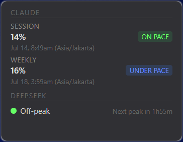

# Claude DeepSeek Monitor

A compact desktop overlay that shows your Claude Code usage pacing and DeepSeek peak pricing windows at a glance.

**240×185px floating widget** → always-on-top, draggable, system tray icon. Refresh interval is configurable (default 5 minutes).



## Features

- **Claude Code session usage** — % used, time to reset, pacing ("UNDER PACE" / "ON PACE" / "OVER PACE")
- **Claude Code weekly quota** — % used, time to reset, pacing
- **DeepSeek peak pricing** — persistently shows peak/off-peak status with time to next transition
- **OS notifications** — fired exactly when a DeepSeek peak window starts or ends (edge-triggered, not every poll)
- **Stale state** — if `/usage` parsing fails, last known values shown dimmed
- **Settings panel** — editable DeepSeek windows (Beijing time), refresh interval, auto-launch toggle
- **Tray icon** — click to show/hide widget, right-click for Settings and Quit

## Prerequisites

- [Claude Code CLI](https://docs.anthropic.com/en/docs/claude-code/overview) — must be installed and authenticated (`claude --print "/usage"` must work)
- Windows or macOS

## Development

```bash
# Build and run
cd src-tauri
cargo run

# Run unit tests (poll_cycle function)
cargo test
```

### Project structure

```
src-tauri/src/
├── main.rs              # Binary entry point
├── lib.rs               # Tauri app shell: tray, polling, settings, notifications
└── poll_cycle.rs        # Pure poll-cycle function + 24 unit tests (functional core)

dist/
├── index.html           # Floating widget UI
└── settings.html        # Settings panel
```

### Architecture

**Functional core, imperative shell.**

All business logic lives in a single pure function `poll_cycle()`:

```
(raw_usage_text, current_time, config, previous_state)
    → (new_display_state, notification_events)
```

The Tauri shell handles all I/O: spawning `claude --print "/usage"`, reading the clock, firing OS notifications, rendering the widget, persisting settings.

### Design decisions

| Decision | Choice |
|----------|--------|
| Framework | [Tauri v2](https://v2.tauri.app) (Rust backend, web frontend) |
| Poll interval | User-configurable (default 5 minutes, min 1) |
| Pacing threshold | ±15 percentage points around even pace |
| DeepSeek windows | 09:00–12:00 and 14:00–18:00 Beijing time (UTC+8, no DST) |
| Settings storage | `settings.json` in OS app data directory |
| Auto-launch | `tauri-plugin-autostart` (on by default) |

### Testing

Only the pure `poll_cycle()` function is unit-tested (24 tests). The imperative shell is verified manually.

## Building

```bash
cd src-tauri
cargo build --release
```

The built binary will be at `src-tauri/target/release/claude-deepseek-monitor.exe`.

## License

MIT
